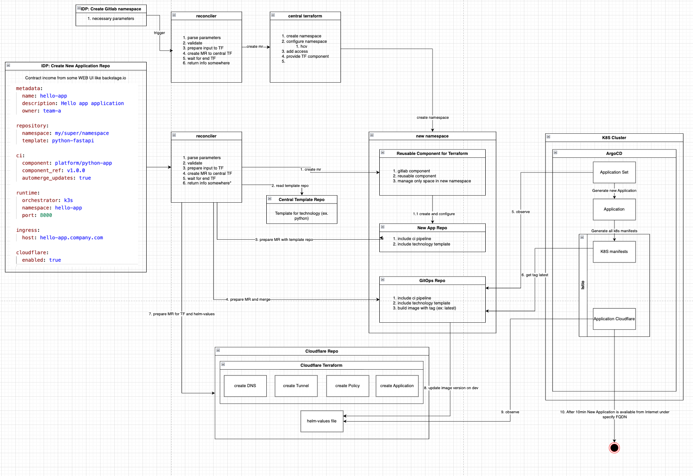

# Architecture

## Overview

This document describes the high-level architecture of a lightweight Internal Developer Platform based on GitLab, Terraform, GitOps, Argo CD and Kubernetes.

The platform is built around a declarative application contract. The contract describes the desired application state, while the platform translates it into repository configuration, CI/CD setup, GitOps configuration and Kubernetes deployment state.

## High-Level Architecture

```text
Developer
   |
   v
Application Contract
   |
   v
IDP Reconciler
   |
   +--> Terraform Repository
   |        |
   |        v
   |      GitLab Resources
   |
   +--> Application Repository
   |        |
   |        v
   |      CI/CD Pipeline
   |
   +--> GitOps Repository
   |        |
   |        v
   |      Argo CD
   |        |
   |        v
   |      Kubernetes
   |
   +--> Cloudflare Configuration
            |
            v
          External Access
```

## Architecture Diagram

```md

```

Recommended files:

```text
diagrams/
├── high-level.drawio
└── high-level.png
```

The `.drawio` file should be stored together with the exported `.png` file so the diagram remains editable.

## Core Components

| Component              | Responsibility                                                |
| ---------------------- | ------------------------------------------------------------- |
| Application Contract   | User-facing declarative input                                 |
| IDP Reconciler         | Generates platform changes from the contract                  |
| Terraform Repository   | Source of truth for GitLab and platform resource provisioning |
| Application Repository | Source code, tests and application pipeline entrypoint        |
| CI/CD Components       | Reusable platform-owned pipeline logic                        |
| GitOps Repository      | Desired Kubernetes application state                          |
| Argo CD                | Reconciles GitOps state into Kubernetes                       |
| Kubernetes             | Runtime platform                                              |
| Cloudflare             | Optional external access layer                                |
| GitLab Merge Requests  | Review and audit mechanism for generated changes              |

## Application Contract

The application contract is the main interface between users and the platform.

Example:

```yaml
apiVersion: idp.msurmanski.com/v1alpha1
kind: Application

metadata:
  name: hello-app
  owner: team-platform

repository:
  namespace: owned/homelab/applications
  template: python-fastapi

runtime:
  orchestrator: k3s
  port: 8000
  replicas: 2

ingress:
  enabled: true
  host: hello-app.example.com
```

The contract describes intent. It should avoid leaking internal platform implementation details.

## IDP Reconciler

The reconciler is responsible for translating the application contract into platform changes.

It may generate merge requests to:

* Terraform repository
* GitOps repository
* Application repository
* Cloudflare configuration repository

The reconciler should not bypass Git. Its output should be reviewable.

## Repository Provisioning

Repository provisioning is handled through Terraform.

```text
Application Contract
        |
        v
IDP Reconciler
        |
        v
Terraform Repository MR
        |
        v
Terraform Apply
        |
        v
GitLab Repository
```

This model keeps GitLab resources declarative, auditable and versioned.

## CI/CD Architecture

Application repositories consume reusable CI/CD components.

```text
Application Repository
        |
        v
.gitlab-ci.yml
        |
        v
Platform CI Component
        |
        v
Build, Test, Scan, Publish
```

The platform owns the reusable pipeline logic. Application teams own application code.

## Deployment Architecture

Applications are deployed through GitOps.

```text
Application Repository
        |
        v
CI Pipeline
        |
        v
Container Image
        |
        v
GitOps Repository MR
        |
        v
Argo CD
        |
        v
Kubernetes
```

The application pipeline does not deploy directly to Kubernetes.

## Ingress Architecture

Ingress configuration is generated from the application contract.

```text
Application Contract
        |
        v
ingress.host
        |
        v
GitOps Repository
        |
        v
Kubernetes Ingress / Istio VirtualService
        |
        v
Application
```

For public or protected external access, Cloudflare can be enabled:

```text
Cloudflare
    |
    v
Ingress Gateway
    |
    v
Application Service
```

## Security Boundaries

The platform should maintain clear security boundaries:

| Area              | Boundary                                                 |
| ----------------- | -------------------------------------------------------- |
| Application teams | Own source code and application configuration            |
| Platform team     | Own templates, CI/CD components and deployment standards |
| GitLab            | Source control and CI/CD execution                       |
| Terraform         | GitLab/platform resource provisioning                    |
| Argo CD           | Kubernetes reconciliation                                |
| Kubernetes        | Runtime isolation through namespaces and policies        |
| Cloudflare        | External access and optional Zero Trust controls         |

## Source of Truth

Different responsibilities have different sources of truth:

| Domain                   | Source of Truth                     |
| ------------------------ | ----------------------------------- |
| GitLab resources         | Terraform repository                |
| Application source code  | Application repository              |
| Kubernetes desired state | GitOps repository                   |
| CI/CD standards          | Platform CI component repository    |
| External routes          | Cloudflare configuration repository |
| Platform decisions       | ADR documents                       |

## Key Design Decisions

### Git as the Control Plane

All platform changes should be represented in Git.

### Merge Requests as Change Interface

Automation creates merge requests instead of applying hidden changes.

### Terraform for Provisioning

Terraform manages GitLab and platform resources.

### GitOps for Deployment

Argo CD reconciles Kubernetes state from Git.

### Components for CI/CD Reuse

CI/CD logic is reused through versioned platform components.

### Contract-Driven Onboarding

Users describe desired state. The platform decides how to implement it.

## Failure Domains

Potential failure domains:

| Failure                    | Impact                                           |
| -------------------------- | ------------------------------------------------ |
| Reconciler unavailable     | New onboarding and generated updates are delayed |
| Terraform pipeline failure | GitLab resource provisioning is blocked          |
| GitOps pipeline failure    | Deployment state cannot be updated               |
| Argo CD unavailable        | New desired state is not reconciled              |
| Kubernetes unavailable     | Applications are unavailable                     |
| Cloudflare unavailable     | External access may be unavailable               |

The platform should fail safely. Existing applications should continue running when the reconciler is unavailable.

## Future Improvements

Potential future enhancements:

* multi-environment support
* policy validation before merge
* ownership validation
* automated component upgrades
* progressive delivery
* secrets integration
* namespace lifecycle management
* service catalog integration
* observability dashboards
